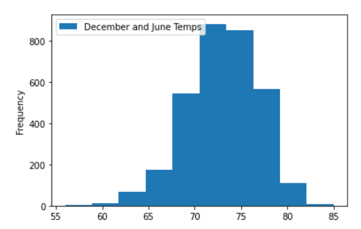

#Investing in Waves and Ice Cream

## Overview of the analysis:
Wang is planning to run a shop Surf n' Shake to bring surfboards and ice cream to locals and tourists. However, he felt he need an investor to start his business.  
He found W. Avy is a good candidate for the investment, and he wants to present a nice business plan by properly analyzing the data to impress him. He needs to develop this plan fast
 and accurately so he chose SQLite as DB and Python to run it through. 

## Results:
Wang decided to run one statistic for June, the most prosperous month, and one statistics for December to prove that the even least prosperous month can make a profit 
since the precipitation in Hawaii is not bad throughout the year.  So he gathers the following data 

<b>All available June temperature Statistics</b>

<b>All available December temperatures Statistics</b>

<b>Major Points </b>
- June data shows an average temperature little higher than 74 and a standard deviation of 3.25, which tells us most of the temperature will remain in the ‘70s and the business can perform well.
- December data shows the average temperature of a little higher than 71 and a standard deviation of near 3.75, which tells us little over 25 % of the time, the temperature will be less than the ‘70s and compared to June, it may be less profitable than June.
- Even though there is slight differences between June temporature vs. December temprature, the business can do well though out the year and little loss of December can be covered by June's great profit.

## Summary:
- W. Avy might want to check other cercumstances.	
- W. Avy might ask what is combned ratio of June and December.
- W. AVy might ask what is the total statistics of last 5 years.
- With what is showing here so far, he defintely should inversting the shop what is proposed.

<b>June and December temporature Statistics</b>

<b>Last 5 Years temporature Statistics</b>

